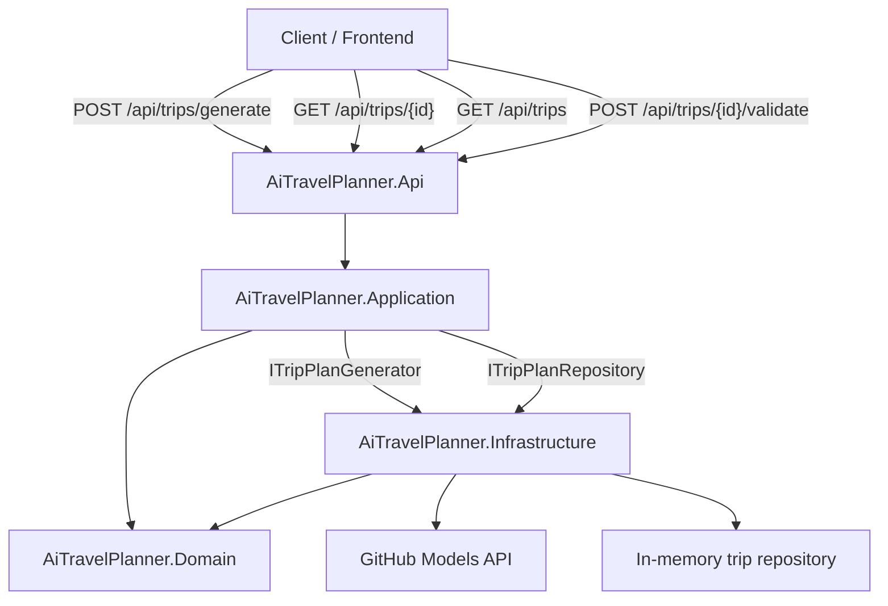

# Phase 1 - Raw LLM Integration

## Goal

Build the first working AI trip generation flow using a direct model provider call, without LangChain, LangGraph, or agents.

## Current Flow

```text
POST /api/trips/generate
  -> GenerateTripRequest
  -> GenerateTripCommand
  -> GenerateTripHandler
  -> ITripPlanGenerator
  -> GitHubModelsTripPlanGenerator
  -> IGitHubModelsClient
  -> GitHub Models API
  -> GeneratedTripPlan
  -> Domain Plan
  -> ITripPlanValidator
  -> ITripPlanRepository
  -> GenerateTripResponse
```

## What This Phase Demonstrates

* ASP.NET Core Web API
* Clean Architecture boundaries
* Provider-neutral application interfaces
* Raw LLM provider integration
* Prompting for structured JSON
* JSON deserialization into provider DTOs
* Mapping provider DTOs to domain models
* Validation issues
* One retry when budget is exceeded
* In-memory persistence
* Basic provider/model/token metadata

## What This Phase Avoids

* LangChain
* LangGraph
* Multi-agent orchestration
* PostgreSQL
* Real maps, flights, or hotel APIs

## Main Learning

Raw provider integration is enough when the workflow is still simple. As validation, retry, branching, provider concerns, and observability grow, orchestration abstractions become more useful.

## Architecture Diagram


